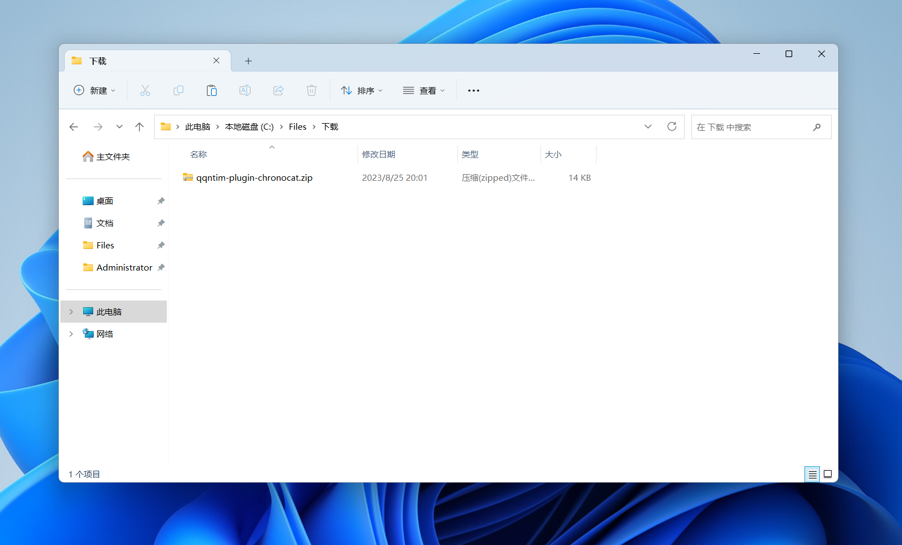
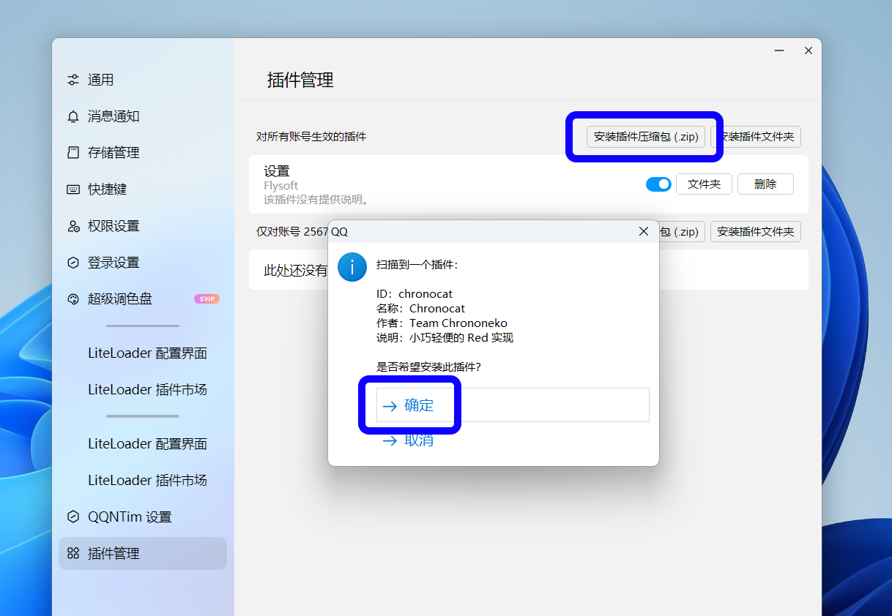
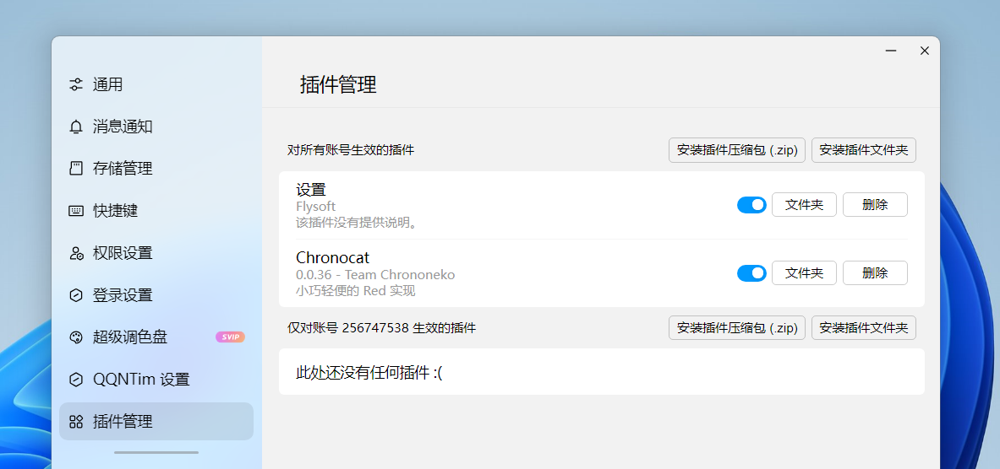

import Link from '@docusaurus/Link'
import { UntrustedContents } from '@site/src/components/UntrustedContents'

## 步骤 1：安装 QQNTim

<UntrustedContents />

QQNTim 提供了详细的安装教程，可以直接前往 QQNTim 的主页查看。

<Link
  className="button button--secondary button--lg"
  to="https://github.com/FlysoftBeta/QQNTim"
>
  前往 QQNTim
</Link>

简单来说，从 [这里](https://github.com/Flysoft-Studio/QQNTim/releases) 下载最新版本的
QQNTim，解压后直接双击运行 `install.cmd` 即可。

结论：你已安装 QQNTim。

## 步骤 2：安装 Chronocat

前往下方的 Chronocat 下载页，下载最新版本的 Chronocat QQNTim
插件。文件名应当类似 `chronocat-qqntim-v0.0.0.zip`。

<Link
  className="button button--secondary button--lg"
  to="https://github.com/chrononeko/chronocat/releases"
>
  前往 Chronocat 下载页
</Link>

下载完成后，将文件解压，你会得到另一个名为 `qqntim-plugin-chronocat.zip` 的压缩包。

## 步骤 3：启动 QQ

启动 QQ 并登录机器人的账号后，在左下角的菜单中点击「设置」。

打开「插件管理」，然后点击「对所有账号生效的插件」下方的「安装插件压缩包」，选择刚刚解压得到的压缩包。

安装完成后，QQ 会自动重启。重启后，确保 Chronocat 已安装并已启动。

结论：Chronocat 已成功安装在你的 QQ 上。

接下来，你可以将 Chronocat 接入你喜爱的应用或框架。

<Link
  className="button button--secondary button--lg button--normal"
  to="/connect"
>
  前往接入
</Link>
